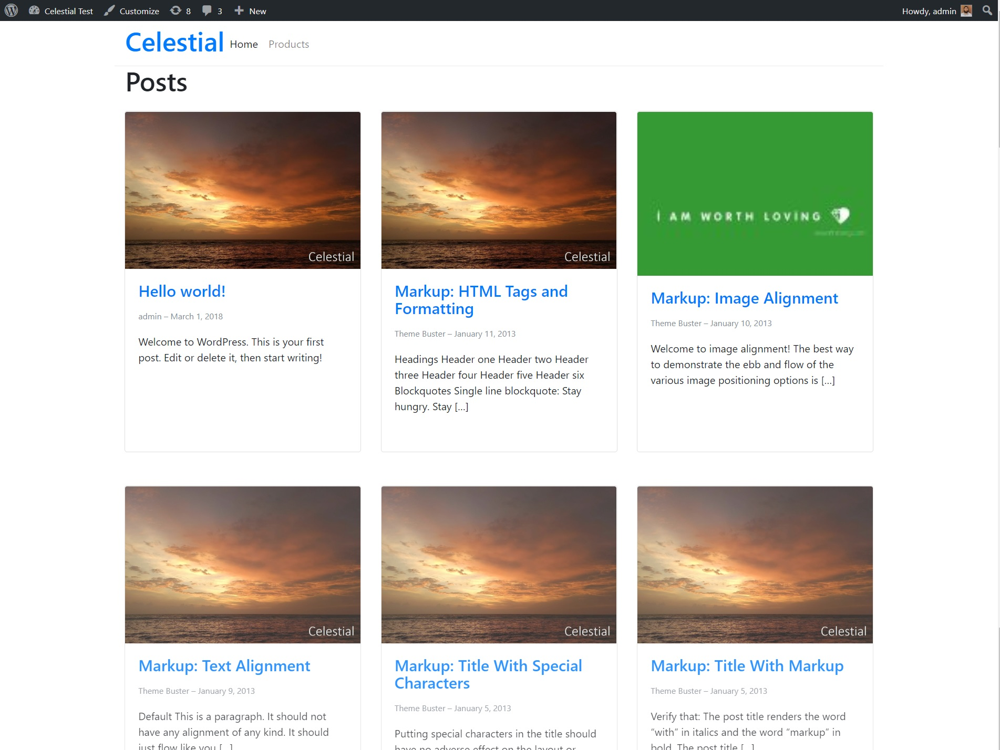

# Celestial theme
A WordPress theme using React 16, Bootstrap 4 and Webpack 3.

This is a support project of the article I wrote for Smashing Magazine. https://www.smashingmagazine.com/2018/03/react-wordpress-web-app

Update (July 25, 2018):
1. Got rid of jQuery and other enqueued script files
2. Updated footer with dynamic year and center text
3. Used the Loader where appropriate
4. Updated almost all packaages (React to v16.4.1)

I intend to continue developing the project by building the Next Steps of the article in the **'next-steps'** branch.

Setup
-----

The following pre-requisites should be in place for the theme to work:

1. WordPress version 4.7 or later
2. Posts permalink set set to: Custom Structure - /posts/%postname%/
3. Products permalink to be set as: Custom base - /products/

Installing and beginning development
------------------------------------

1. git clone https://github.com/m-muhsin/celestial
2. cd celestial
3. npm install
4. npm run build
5. Head over to Appearances > Themes in your WordPress Dashboard and Select 'Celestial'

Now you can continue developing the Celestial theme. All the best!

Support
-------

If you find any problems with this theme, please report an issue at:
(https://github.com/m-muhsin/celestial/issues).

Thank you for checking out Celestial!